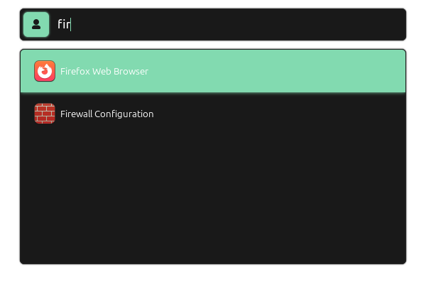
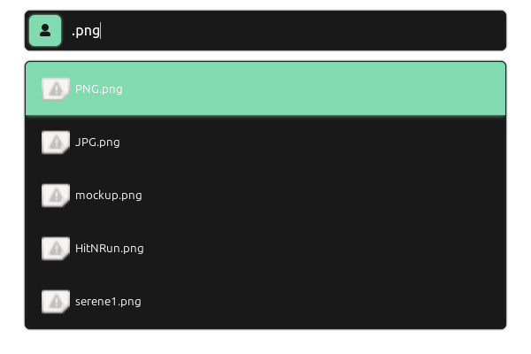

# Serene

**Serene** is a fast, elegant, and extensible spotlight-style search application for Linux desktops. Inspired by macOS Spotlight and Alfred, Serene provides a powerful keyboard-centric search interface that integrates deeply with your applications and system.

Serene is a WIP and looking for active contributors.

## ✨ Features

- Blazing-fast application search
- Agent mode for personal AI assistance
- Clean and modern UI with GTK4
- Built with C++ for performance

## 🖥️ Screenshots





## 🔧 Build Instructions

### Requirements

Make sure your system has the following dependencies installed:

- `clang++` or `g++`
- `make`
- GTK4 and gtkmm-4.0 development libraries
- Common GTK-related dependencies:
  - `glibmm-2.68`
  - `giomm-2.68`
  - `pangomm-2.48`
  - `cairomm-1.16`
  - `sigc++-3.0`

On Linux Mint 22.1, you can do the following
```bash
sudo apt update
sudo apt install \
  libgtk-4-dev \
  libgtkmm-4.0-dev \
  libglibmm-2.68-dev \
  libpangomm-2.48-dev \
  libcairomm-1.16-dev \
  libsigc++-3.0-dev \
  pkg-config \
  build-essential
```

## Build the Project

```bash
make
```

To run the application:

```bash
./serene
```

To run tests:

```bash
make test
```

To clean the build:

```bash
make clean
```

## 📁 Project Structure

```bash
src/
├── backend/ # Application search backend
├── components/ # UI components (entry, list view, scroll view)
├── core/ # Main entry point and logic
├── models/ # Application and data models
build/ # Build artifacts (auto-generated)
Makefile # Build instructions
```

Made with ❤️ for Linux.
